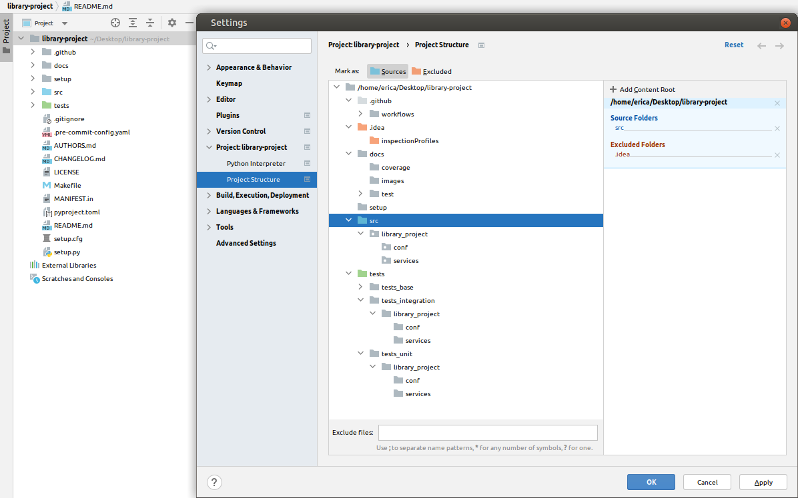
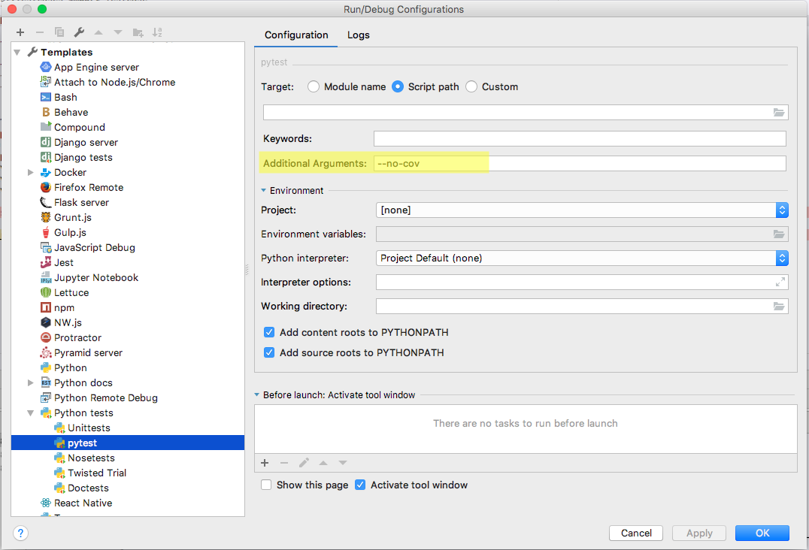

# Setting up the project

To correctly execute the tests and the code using an IDE, we will need to configure the `PYTHONPATH` environment
variable value of our IDE.

## Pycharm

To correctly execute the tests and the code using Pycharm, we will need to mark the `/src` and the `/tests` folders
as **"root source folders"** in Pycharm, so they be included into the **PYTHONPATH** variable automatically and source
code gets detected by the IDE, for example for module imports, avoiding the need of working with relative imports.

To do that, from the right click in the folder `src` and choose the option **"Mark directory as"-> "Root Source
folder"**. Also, right click in the folder `test` and choose the option **"Mark directory as"-> "Test Sources Root"**.

Once configured, both folders should be shown with **blue** and **green** color in the IDE, this configuration can also
be checked in the project settings:



> **NOTE**:
>
> Note that when setting the `tests` package as *"Test Sources Root"**, PyCharm's automatic imports will not set
> the **tests** package as the main package (instead of `from tests.tests_unit` it will appear `from tests_unit`),
> so you should check these imports and make sure they start with **tests.**
>
> If you want to avoid this problem, all you have to do is not mark the `tests` directory as **"Test Sources Root"**

## VSCode

The `PYTHONPATH` environment variable specifies additional locations where the Python interpreter should look for
modules. In VS Code, `PYTHONPATH` can be set through the terminal settings (**terminal.integrated.env.***) and/or within
an
**.env** file.

You could add the path to src to `PYTHONPATH` by creating an `.env` file within your VS Code workspace.

```dotenv
PYTHONPATH=src
```

Then set **python.envFile** in your `settings.json` file to point to the `.env` file you just created. For example, if
the `.env` file was in your workspace root, your `settings.json` would be set as shown:

```json
"python.envFile": "${workspaceFolder}/.env"
```

For more information see https://code.visualstudio.com/docs/python/environments

# Debugging

## PyCharm

Since the coverage report is enabled for the pytest config, debugging issues may arise when trying to debug within
Pycharm. That is due to an incompatibility from Pycharm with pytest-cov pluging.

The detail of the issue can be read
here: https://stackoverflow.com/questions/34870962/how-to-debug-py-test-in-pycharm-when-coverage-is-enabled

To be able to debug in Pycharm in this scenario apply the following configuration globally:



### Basic development steps

1) **Activate a Python virtual environment**: `conda activate env-py38`

    ```shell
    user@pc:~/evoml-python-commons$ conda activate env-py38
    (env-py38) user@pc:~/evoml-python-commons$ 
    ```

2) **Install the project requirements**: `make req-install`

    ```shell
    (env-py38) user@pc:~/evoml-python-commons$ make req-install 
    make[1]: Entering directory '/home/user/evoml-python-commons'
    ──────────────────────────────────────────────────────────────────────────────────────────────────────────
    ─── Install requirements:  requirements.txt 
    ──────────────────────────────────────────────────────────────────────────────────────────────────────────
   
    [...]
   
    pip freeze > /home/user/evoml-python-commons/setup/requirements_freeze.txt
    ──────────────────────────────────────────────────────────────────────────────────────────────────────────
    ─── Install requirements: requirements_develop.txt
    ──────────────────────────────────────────────────────────────────────────────────────────────────────────

    pip freeze > /home/user/evoml-python-commons/setup/requirements_freeze.txt
    pipdeptree > /home/user/evoml-python-commons/setup/requirements_pipdeptree.txt
    make[1]: Leaving directory '/home/user/evoml-python-commons'
    ```

3) **Check the quality of the code**: `make lint`

    ```shell
    (env-py38) user@pc:~/evoml-python-commons$ make lint
    
    ────────────────────────────────────────────────────────────────────────────────────────────────────────────
    ─── Checking the project code style [flake8]
    ────────────────────────────────────────────────────────────────────────────────────────────────────────────
    
    ────────────────────────────────────────────────────────────────────────────────────────────────────────────
    ─── Checking the project code style [pylint]
    ────────────────────────────────────────────────────────────────────────────────────────────────────────────
    
    --------------------------------------------------------------------
    Your code has been rated at 10.00/10 (previous run: 10.00/10, +0.00)
    
    
    ────────────────────────────────────────────────────────────────────────────────────────────────────────────
    ─── Checking the project code style [mypy]
    ────────────────────────────────────────────────────────────────────────────────────────────────────────────
    Success: no issues found in X source files
    ```

4) **Running the tests**: `make test`

    ```shell
    (env-py38) user@pc:~/evoml-python-commons$ make test
    ================================ test session starts ================================
    platform linux -- Python 3.8, pytest-6.2.5, py-1.11.0, pluggy-1.0.0 -- /home/user/.conda/envs/env-py38/bin/python
    cachedir: .pytest_cache
    rootdir: /home/user/evoml-python-commons, configfile: setup.cfg
    plugins: cov-3.0.0
    collected 2 items                                                                   
    
    tests/unit/evoml_python_commons/conf/test_base_data_types.py::TestDataUtils::test_join_values PASSED [ 50%]
    tests/unit/evoml_python_commons/conf/test_base_data_types.py::TestDataUtils::test_serialize_data PASSED [100%]
    
    ---------- coverage: platform linux, python 3.8-final-0 -----------
    Coverage HTML written to dir docs/coverage
    
    
    ================================= 2 passed in 0.24s =================================
    ```

5) **Library packaging**: To create the wheel of the library you should execute the build of the library:
   ```shell
   (env-py38) user@pc:~/evoml-python-commons$ make package
   ```
   The packaging will take into account the following configuration specified in the [Makefile](../Makefile) file:
    1) **BUILDTOOL**: Identifies the tool used to package the library: `nuitka`, if you want to generate a binary
       library, otherwise `wheel`
    2) **PYTHON**: Python version used to generate the packaging.

6) **Installation of the new library**: To install the library you have 2 options:

    1) Install it directly using the packed file:

        ```shell
        (new-env-py38) user@pc:~/evoml-python-commons$ pip install ./dist/evoml_python_commons-0.0.0-*.whl
        ```

    1) Install it from the Python repository:

        ```shell
        (new-env-py38) user@pc:~/evoml-python-commons$ pip install evoml-python-commons
        ```

